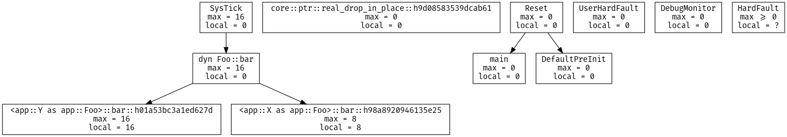

# `cargo-call-stack`

> Whole program static stack analysis

[](https://japaric.github.io/cargo-call-stack/direct.svg)

## Features

- The tool produces a call graph of the selected program as a [dot file].

[dot file]: https://www.graphviz.org/doc/info/lang.html

- Each node (function) in the call graph includes the local stack usage of the
  function, if provided by LLVM (see [`-Z emit-stack-sizes`]).

[`-Z emit-stack-sizes`]: https://doc.rust-lang.org/nightly/unstable-book/compiler-flags/emit-stack-sizes.html

- If the call graph contains no cycles then the tool also computes the maximum
  stack usage of each function, that is the stack usage that includes the stack
  usage of the functions the function may invoke.

## Caveats

Currently the call graph and stack analysis can only reason about *direct*
function calls. Indirect function calls, via pointers (e.g. `fn()`) or trait
objects, are not properly supported. If the program contain these indirect
function calls then the result of the analysis will be imprecise.

The tool assumes that all instances of inline assembly (`asm!`) use zero bytes
of stack. This is not always the case so the tool prints a warning message
for each `asm!` statement it encounters.

The tool assumes that branching (calling a function) does not use the stack
(i.e. no register is pushed onto the stack when branching). This may not be true
for *all* the architectures that Rust supports.

Analysis of `std` programs is currently out of scope. Bug reports related to
`std` programs will be given the lowest priority. The rationale is that the
main goal of this tool is stack analysis, the analysis currently can't
handle indirect function calls, [`std::fmt` uses plenty of trait objects and
function pointers][fmt] and all `std` programs use `std::fmt` (yes, even the
simplest one: `fn main() {}`) thus analyzing `std` programs is pointless at the
moment.

[fmt]: https://japaric.github.io/cargo-call-stack/fmt.svg

The tool only supports ELF binaries.

The tool depends on unstable compiler features and can only be used with a
nightly toolchain. Due to this `cargo-call-stack` could stop working after
updating the compiler.

## Installation

``` console
$ # Rust >=1.31
$ cargo +beta install cargo-call-stack
```

## Example usage

The tool build your program in release mode with LTO enabled, analyses it and
then prints a dot file to stdout. See `cargo call-stack -h` for a list of build
options (e.g. `--features`).

``` console
$ cargo +nightly call-stack --example app > cg.svg
warning: assuming that asm!("") does *not* use the stack
warning: assuming that asm!("") does *not* use the stack
```

Graphviz's `dot` can be used to generate an image from this dot file.

``` console
$ dot -Tsvg -Nfontname='Fira Code' -Nshape=box cg.dot > cg.svg
```

[](https://japaric.github.io/cargo-call-stack/direct.svg)

Each node in this graph represents a function, which could be a free function,
an inherent method or a trait method. Each directed edge indicates a "calls"
relationship. For example, in the above graph `Reset` calls both `main` and
`DefaultPreInit`.

Each node also contains its `local` stack usage in bytes and its `max`-imum
stack usage, also in bytes. The maximum stack usage includes the stack usage of
all the other functions that the function could invoke.

This is the `no_std` program used to generate the call graph shown above.

``` rust
#![feature(asm)]
#![no_std]
#![no_main]

extern crate panic_halt;

use core::ptr;

use cortex_m_rt::{entry, exception};

#[entry]
fn main() -> ! {
    let x = 0;
    unsafe {
        // force `x` to be on the stack
        ptr::read_volatile(&&x);
    }

    foo();

    bar();

    loop {}
}

#[inline(never)]
fn foo() {
    unsafe {
        // spill variables onto the stack
        asm!("" : : "r"(0) "r"(1) "r"(2) "r"(3) "r"(4) "r"(5));
    }
}

#[inline(never)]
fn bar() {
    unsafe {
        // spill variables onto the stack
        asm!("" : : "r"(0) "r"(1) "r"(2) "r"(3) "r"(4) "r"(5) "r"(6) "r"(7));
    }
}

#[exception]
fn SysTick() {
    bar();
}
```

## PoC: support for trait objects

With help from the compiler the tool can reason about dynamic dispatch. As a PoC
we [patched the compiler] to generate call site metadata that lets `cargo
call-stack` include trait objects in its analysis.

> **NOTE** That branch is a PoC and it's only supported by version 0.1.0 of
> `cargo-call-stack`.

[patched the compiler]: https://github.com/japaric/rust/tree/metadata-poc-do-not-delete

The program below uses a trait object (`dyn Foo`) in the `SysTick` exception
handler.

``` rust
#![no_std]
#![no_main]

extern crate panic_halt;

use core::ptr;

use cortex_m::interrupt;
use cortex_m_rt::{entry, exception};

trait Foo {
    fn bar(&self, x: i32) -> i32;
}

struct A; // one implementer

impl Foo for A {
    fn bar(&self, _x: i32) -> i32 {
        unreachable!()
    }
}

struct X; // two implementers

impl Foo for X {
    fn bar(&self, x: i32) -> i32 {
        let y = 0;
        unsafe {
            // force `y` to be allocated on the stack
            ptr::read_volatile(&&y);
        }

        x + 1
    }
}

struct Y; // three implementers

impl Foo for Y {
    fn bar(&self, x: i32) -> i32 {
        let y = 0u64;
        unsafe {
            // force `y` to be allocated on the stack
            ptr::read_volatile(&&y);
        }

        2 * x
    }
}

static mut Z: &Foo = &X;

#[entry]
unsafe fn main() -> ! {
    loop {
        interrupt::free(|_| {
            Z = &Y;
        });
    }
}

#[exception]
unsafe fn SysTick() {
    // dynamic dispatch
    Z.bar(42);
}
```

With the patched compiler the tool generates the following graph.

[](https://japaric.github.io/cargo-call-stack/dyn.svg)

Note that `SysTick` invokes the `bar` method on the trait object `dyn Foo`. The
tool knows that there are only two `Foo` implementers in the final binary; this
is reflected in the call graph and the tool is able to compute the maximum stack
usage of `SysTick`.

If you are interested in making the compiler generate the required information
to make this tool properly support dynamic dispatch then check out [this issue].

[this issue]: https://github.com/japaric/cargo-call-stack/issues/1

## License

Licensed under either of

- Apache License, Version 2.0 ([LICENSE-APACHE](LICENSE-APACHE) or
  http://www.apache.org/licenses/LICENSE-2.0)
- MIT license ([LICENSE-MIT](LICENSE-MIT) or http://opensource.org/licenses/MIT)

at your option.

### Contribution

Unless you explicitly state otherwise, any contribution intentionally submitted
for inclusion in the work by you, as defined in the Apache-2.0 license, shall be
dual licensed as above, without any additional terms or conditions.
