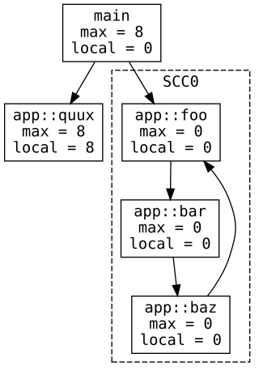
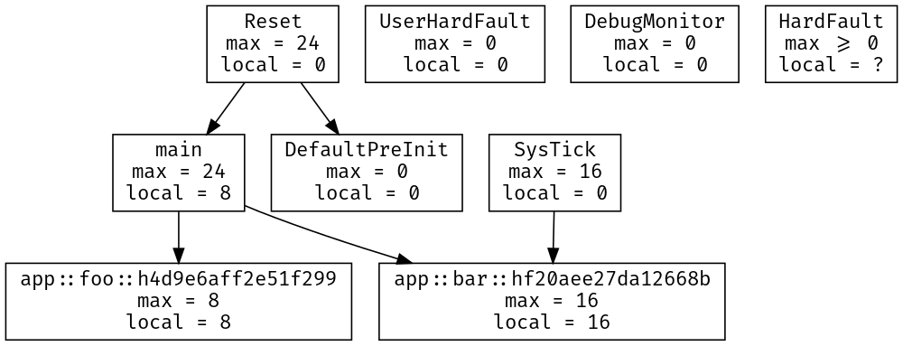
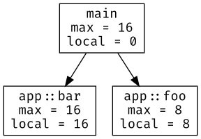
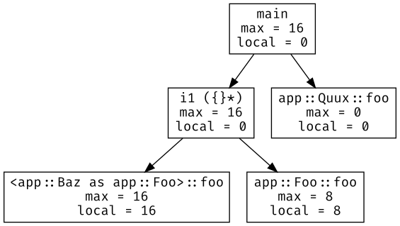
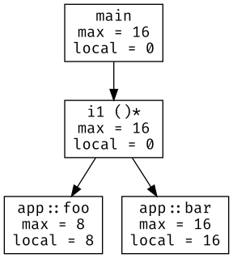
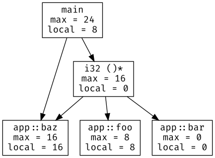

# `cargo-call-stack`

> Static, whole program stack analysis

<p align="center">
  <a href="https://japaric.github.io/cargo-call-stack/cycle.svg">
    
  </a>
</p>

Other examples:
[Embedded CoAP / IPv4 server](https://japaric.github.io/cargo-call-stack/ipv4.svg)
([source](https://github.com/japaric/jnet/tree/b5bd70cb998b1e01236f6b07ebc516a0359fde3d/firmware#ipv4))
["Hello, world!"](https://japaric.github.io/cargo-call-stack/hello.svg)

**HEADS UP**: This tool relies on an experimental feature (`-Z stack-sizes`)
and implementation details of `rustc` (like symbol mangling) and could stop
working with a nightly toolchain at any time. You have been warned!

## Features

- The tool produces the full call graph of a program as a [dot file].

[dot file]: https://www.graphviz.org/doc/info/lang.html

- A [start point](#start-point) can be specified to analyze only the call graph
  that begins at that function.

- Each node (function) in the call graph includes the local stack usage of the
  function, *if* available (see [`-Z emit-stack-sizes`]).

[`-Z emit-stack-sizes`]: https://doc.rust-lang.org/nightly/unstable-book/compiler-flags/emit-stack-sizes.html

- The *maximum stack usage* of each function is also computed, or at least a
  lower bound is provided. Maximum stack usage of a function here refers to the
  stack usage that includes the stack used by functions that the function may
  invoke.

- The tool has *imperfect* support for calls through function pointers (`fn()`)
  and dynamic dispatch (`dyn Trait`). You *will* get a call graph from programs
  that do indirect calls but it will likely be missing edges or contain
  incorrect edges. It's best to use this tool on programs that only do direct
  function calls.

## Installation

``` console
$ # NOTE always use the latest stable release
$ cargo +stable install cargo-call-stack

$ rustup +nightly component add rust-src
```

## Example usage

The tool builds your program in release mode with LTO enabled, analyses it and
then prints a dot file to stdout. See `cargo call-stack -h` for a list of build
options (e.g. `--features`).

[`cortex-m-rt`]: https://crates.io/crates/cortex-m-rt

> IMPORTANT: the analysis corresponds to the newly produced binary,
> which won't be the same as the binary produced by `cargo +nightly build --release`

``` console
$ cargo +nightly call-stack --example app > cg.dot
warning: assuming that llvm_asm!("") does *not* use the stack
warning: assuming that llvm_asm!("") does *not* use the stack
```

Graphviz's `dot` can then be used to generate an image from this dot file.

``` console
$ dot -Tsvg cg.dot > cg.svg
```

[](https://japaric.github.io/cargo-call-stack/direct.svg)

Each node in this graph represents a function, which could be a free function,
an inherent method or a trait method. Each directed edge indicates a "calls"
relationship. For example, in the above graph `Reset` calls both `main` and
`DefaultPreInit`.

Each node also contains its `local` stack usage in bytes and its `max`-imum
stack usage, also in bytes. The maximum stack usage includes the stack usage of
all the other functions that the function could invoke.

This is the `no_std` program used to generate the call graph shown above.

``` rust
#![feature(llvm_asm)]
#![no_main]
#![no_std]

extern crate panic_halt;

use core::ptr;

use cortex_m_rt::{entry, exception};

#[entry]
fn main() -> ! {
    foo();

    bar();

    loop {}
}

#[inline(never)]
fn foo() {
    // spill variables onto the stack
    unsafe { llvm_asm!("" : : "r"(0) "r"(1) "r"(2) "r"(3) "r"(4) "r"(5)) }
}

#[inline(never)]
fn bar() {
    unsafe { llvm_asm!("" : : "r"(0) "r"(1) "r"(2) "r"(3) "r"(4) "r"(5) "r"(6) "r"(7)) }
}

#[exception]
fn SysTick() {
    bar();
}

#[inline(never)]
fn baz() {
    let x = 0;
    unsafe {
        // force `x` to be on the stack
        ptr::read_volatile(&&x);
    }

}
```

> In the previous example the call graph contained disconnected subgraphs. The
> reason for that is *exceptions* (also known as interrupts). `SysTick`, for
> example, is an exception handler that can preempt any function called from
> `Reset`. This exception handler is never called from software but can be
> invoked by the hardware at any time. These exception handlers can appear as
> the roots of disconnected subgraphs.

## Start point

In some cases you may be interested in the maximum stack usage of a particular
function. The tool lets you specify a *start point* which will be used to filter
the call graph to only include nodes reachable from that function.

If we invoke the tool on the previous program but select `main` as the start
point we get this call graph:

``` console
$ cargo +nightly call-stack --example app main > cg.dot
warning: assuming that llvm_asm!("") does *not* use the stack
warning: assuming that llvm_asm!("") does *not* use the stack
```

<p align="center">
  <a href="https://japaric.github.io/cargo-call-stack/filtered.svg">
    
  </a>
</p>

Notice that `SysTick` and `baz` don't appear in this call graph since they are
not reachable from `main`.

## Cycles

The tool can, in some cases, compute the maximum stack usage of programs that
involve recursion. Recursion appears as cycles in the call graph. Consider the
following example:

``` rust
#![feature(llvm_asm)]
#![no_main]
#![no_std]

extern crate panic_halt;

use core::sync::atomic::{AtomicBool, Ordering};

use cortex_m_rt::{entry, exception};

static X: AtomicBool = AtomicBool::new(true);

#[inline(never)]
#[entry]
fn main() -> ! {
    foo();

    quux();

    loop {}
}

// these three functions form a cycle that breaks when `SysTick` runs
#[inline(never)]
fn foo() {
    if X.load(Ordering::Relaxed) {
        bar()
    }
}

#[inline(never)]
fn bar() {
    if X.load(Ordering::Relaxed) {
        baz()
    }
}

#[inline(never)]
fn baz() {
    if X.load(Ordering::Relaxed) {
        foo()
    }
}

#[inline(never)]
fn quux() {
    // spill variables onto the stack
    unsafe { llvm_asm!("" : : "r"(0) "r"(1) "r"(2) "r"(3) "r"(4) "r"(5)) }
}

#[exception]
fn SysTick() {
    X.store(false, Ordering::Relaxed);
}
```

It produces the following call graph:

<p align="center">
  <a href="https://japaric.github.io/cargo-call-stack/cycle.svg">
    
  </a>
</p>

The functions `foo`, `bar` and `baz` use zero stack space thus the cycle formed
by them also uses zero stack space. In this particular case the maximum stack
usage of `main` can be computed.

For the curious this is the disassembly of the "cyclic" program:

``` armasm
08000400 <app::foo>:
 8000400:       f240 0000       movw    r0, #0
 8000404:       f2c2 0000       movt    r0, #8192       ; 0x2000
 8000408:       7800            ldrb    r0, [r0, #0]
 800040a:       0600            lsls    r0, r0, #24
 800040c:       bf18            it      ne
 800040e:       f000 b801       bne.w   8000414 <app::bar>
 8000412:       4770            bx      lr

08000414 <app::bar>:
 8000414:       f240 0000       movw    r0, #0
 8000418:       f2c2 0000       movt    r0, #8192       ; 0x2000
 800041c:       7800            ldrb    r0, [r0, #0]
 800041e:       0600            lsls    r0, r0, #24
 8000420:       bf18            it      ne
 8000422:       f000 b801       bne.w   8000428 <app::baz>
 8000426:       4770            bx      lr

08000428 <app::baz>:
 8000428:       f240 0000       movw    r0, #0
 800042c:       f2c2 0000       movt    r0, #8192       ; 0x2000
 8000430:       7800            ldrb    r0, [r0, #0]
 8000432:       0600            lsls    r0, r0, #24
 8000434:       bf18            it      ne
 8000436:       f7ff bfe3       bne.w   8000400 <app::foo>
 800043a:       4770            bx      lr

0800043c <app::quux>:
 800043c:       b580            push    {r7, lr}
 800043e:       f04f 0c00       mov.w   ip, #0
 8000442:       f04f 0e01       mov.w   lr, #1
 8000446:       2202            movs    r2, #2
 8000448:       2303            movs    r3, #3
 800044a:       2004            movs    r0, #4
 800044c:       2105            movs    r1, #5
 800044e:       bd80            pop     {r7, pc}

08000450 <main>:
 8000450:       f7ff ffd6       bl      8000400 <app::foo>
 8000454:       f7ff fff2       bl      800043c <app::quux>
 8000458:       e7fe            b.n     8000458 <main+0x8>
```

And yes, the estimated maximum stack usage is correct as shown in this debug
session:

``` console
(gdb) b app::foo

(gdb) b app::bar

(gdb) b app::baz

(gdb) c
Continuing.

Breakpoint 3, main () at src/main.rs:16
16          foo();

(gdb) p $sp
$1 = (void *) 0x20005000

(gdb) c
Continuing.
halted: PC: 0x08000400

Breakpoint 4, app::foo () at src/main.rs:31
31          if X.load(Ordering::Relaxed) {

(gdb) p $sp
$2 = (void *) 0x20005000

(gdb) c
Continuing.
halted: PC: 0x0800040c

Breakpoint 5, app::bar () at src/main.rs:38
38          if X.load(Ordering::Relaxed) {

(gdb) p $sp
$3 = (void *) 0x20005000

(gdb) c
Continuing.
halted: PC: 0x08000420

Breakpoint 6, app::baz () at src/main.rs:45
45          if X.load(Ordering::Relaxed) {

(gdb) p $sp
$4 = (void *) 0x20005000

(gdb) c
Continuing.
halted: PC: 0x08000434

Breakpoint 4, app::foo () at src/main.rs:31
31          if X.load(Ordering::Relaxed) {

(gdb) p $sp
$5 = (void *) 0x20005000
```

## Trait object dispatch

In *some* cases the tool can produce correct call graphs for programs that use
trait objects -- more details about where and how it fails in the ["Known
limitations"](#known-limitations) section. Here's an example:

``` rust
#![feature(llvm_asm)]
#![no_main]
#![no_std]

extern crate panic_halt;

use cortex_m_rt::{entry, exception};
use spin::Mutex; // spin = "0.5.0"

static TO: Mutex<&'static (dyn Foo + Sync)> = Mutex::new(&Bar);

#[entry]
#[inline(never)]
fn main() -> ! {
    // trait object dispatch
    (*TO.lock()).foo();

    Quux.foo();

    loop {}
}

trait Foo {
    // default implementation of this method
    fn foo(&self) -> bool {
        // spill variables onto the stack
        unsafe { llvm_asm!("" : : "r"(0) "r"(1) "r"(2) "r"(3) "r"(4) "r"(5)) }

        false
    }
}

struct Bar;

// uses the default method implementation
impl Foo for Bar {}

struct Baz;

impl Foo for Baz {
    // overrides the default method
    fn foo(&self) -> bool {
        unsafe { llvm_asm!("" : : "r"(0) "r"(1) "r"(2) "r"(3) "r"(4) "r"(5) "r"(6) "r"(7)) }

        true
    }
}

struct Quux;

impl Quux {
    // not a trait method!
    #[inline(never)]
    fn foo(&self) -> bool {
        // NOTE(llvm_asm!) side effect to preserve function calls to this method
        unsafe { llvm_asm!("NOP" : : : : "volatile") }

        false
    }
}

// this handler can change the trait object at any time
#[exception]
fn SysTick() {
    *TO.lock() = &Baz;
}
```

The tool produces the following call graph:

<p align="center">
  <a href="https://japaric.github.io/cargo-call-stack/to.svg">
    
  </a>
</p>

Here `i1 ({}*)` denotes dynamic dispatch of a method with (Rust) signature
`fn(&[mut] self) -> bool`. The dynamic dispatch can invoke either `Bar.foo`,
which boils down to the default method implementation (`app::Foo::foo` in the
graph), or `Baz.foo` (`<app::Baz as app::Foo>::foo` in the graph). In this case
the tool does *not* a draw an edge between `i1 ({}*)` and `Quux::foo`, whose
signature is also `fn(&self) -> bool`, so the call graph is accurate.

If you are wondering why we use LLVM notation for the function signature of the
trait method: that's because the tool operates on LLVM-IR where there's no
`bool` primitive and most of Rust's type information has been erased.

## Function pointers

In *some* cases the tool can produce correct call graphs for programs that
invoke functions via pointers (e.g. `fn()`). Here's an example:

``` rust
#![feature(llvm_asm)]
#![no_main]
#![no_std]

extern crate panic_halt;

use core::sync::atomic::{AtomicPtr, Ordering};

use cortex_m_rt::{entry, exception};

static F: AtomicPtr<fn() -> bool> = AtomicPtr::new(foo as *mut _);

#[inline(never)]
#[entry]
fn main() -> ! {
    if let Some(f) = unsafe { F.load(Ordering::Relaxed).as_ref() } {
        // call via function pointer
        f();
    }

    loop {}
}

fn foo() -> bool {
    // spill variables onto the stack
    unsafe { llvm_asm!("" : : "r"(0) "r"(1) "r"(2) "r"(3) "r"(4) "r"(5)) }

    false
}

fn bar() -> bool {
    unsafe { llvm_asm!("" : : "r"(0) "r"(1) "r"(2) "r"(3) "r"(4) "r"(5) "r"(6) "r"(7)) }

    true
}

// this handler can change the function pointer at any time
#[exception]
fn SysTick() {
    F.store(bar as *mut _, Ordering::Relaxed);
}
```

The tool produces the following call graph:

<p align="center">
  <a href="https://japaric.github.io/cargo-call-stack/fn.svg">
    
  </a>
</p>

The node `i1 ()*` represents a call via function pointer -- the LLVM type `i1
()*` is equivalent to Rust's `fn() -> bool`. This indirect call could invoke
`foo` or `bar`, the only functions with signature `fn() -> bool`.

## Known limitations

### Lossy type information

To reason about indirect function calls the tool uses the type information
available in the LLVM-IR of the program. This information does not exactly match
Rust's type information and leads to mislabeling of functions. For example,
consider this program:

``` rust
#![feature(llvm_asm)]
#![no_main]
#![no_std]

extern crate panic_halt;

use core::{
    ptr,
    sync::atomic::{AtomicPtr, Ordering},
};

use cortex_m_rt::{entry, exception};

static F: AtomicPtr<fn() -> u32> = AtomicPtr::new(foo as *mut _);

#[inline(never)]
#[entry]
fn main() -> ! {
    if let Some(f) = unsafe { F.load(Ordering::Relaxed).as_ref() } {
        // call via function pointer
        f();
    }

    let x = baz();
    unsafe {
        // NOTE(volatile) used to preserve the return value of `baz`
        ptr::read_volatile(&x);
    }

    loop {}
}

// this handler can change the function pointer at any time
#[exception]
fn SysTick() {
    F.store(bar as *mut _, Ordering::Relaxed);
}

fn foo() -> u32 {
    // spill variables onto the stack
    unsafe { llvm_asm!("" : : "r"(0) "r"(1) "r"(2) "r"(3) "r"(4) "r"(5)) }

    0
}

fn bar() -> u32 {
    1
}

#[inline(never)]
fn baz() -> i32 {
    unsafe { llvm_asm!("" : : "r"(0) "r"(1) "r"(2) "r"(3) "r"(4) "r"(5) "r"(6) "r"(7)) }

    F.load(Ordering::Relaxed) as usize as i32
}
```

The tool produces the following call graph:

<p align="center">
  <a href="https://japaric.github.io/cargo-call-stack/lossy.svg">
    
  </a>
</p>

Note that the node that represents the indirect function call has type `i32 ()*`
(`fn() -> i32`), not `u32 ()*`. The reason is that there's no `u32` type in
LLVM, there are only signed integers. This leads the tool to wrongly add an edge
between `i32 ()*` and `baz`. If the tool had Rust's type information then this
edge would have not been added.

### Miscellaneous

Inline assembly breaks LLVM's stack usage analysis.
LLVM does *not* consider inline assembly in its analysis and reports an incorrect number.
In this case, `cargo-call-stack` will use its own stack usage analysis based on machine code, which only supports the ARM Cortex-M architecture.

Hardware exceptions, like `SysTick` on Cortex-M devices, appear as disconnected nodes in the call graph.
At the moment, `cargo-call-stack` cannot compute the whole program maximum stack usage when exceptions are present.

The tool only supports ELF binaries because `-Z emit-stack-sizes` only supports the ELF format.

## License

Licensed under either of

- Apache License, Version 2.0 ([LICENSE-APACHE](LICENSE-APACHE) or
  http://www.apache.org/licenses/LICENSE-2.0)
- MIT license ([LICENSE-MIT](LICENSE-MIT) or http://opensource.org/licenses/MIT)

at your option.

### Contribution

Unless you explicitly state otherwise, any contribution intentionally submitted
for inclusion in the work by you, as defined in the Apache-2.0 license, shall be
dual licensed as above, without any additional terms or conditions.
